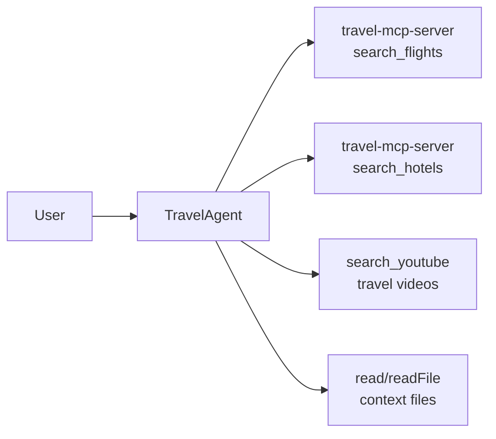
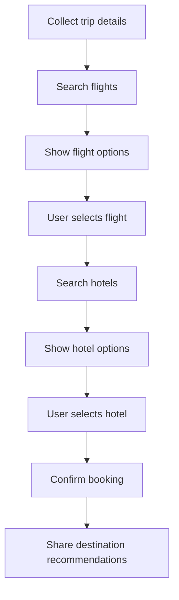

# TravelAgent

TravelAgent is a custom AI agent for planning trips, searching flights, finding hotels, and suggesting destination content.

## At a glance

| Item | Details |
|---|---|
| Purpose | Travel planning, flight search, hotel search, destination recommendations |
| Runtime | Java 17 + Spring AI |
| Editor | VS Code |
| Transport | HTTP/SSE for MCP server communication |
| Main agent file | `travel.agent.md` |
| MCP config | `.vscode/mcp.json` |

## System overview



## Workflow



## How it works

1. Gather travel details such as origin, destination, dates, preferences, and budget.
2. Search flights first, with business class preferred by default.
3. Present up to five flight options with routing, duration, and pricing.
4. Search hotels after a flight is selected, with 4-star or higher hotels preferred.
5. Confirm the booking details and total trip cost.
6. Recommend two destination videos to help the user prepare for the trip.

## Tools

| Tool | Use |
|---|---|
| `travel-mcp-server/search_flights` | Find flight options based on route, dates, and preferences |
| `travel-mcp-server/search_hotels` | Find hotels in the destination city |
| `search_youtube` | Suggest travel videos for the destination |
| `read/readFile` | Read local files for context |

## Configuration

The agent instructions in `travel.agent.md` define the booking flow and tool usage. The MCP server configuration is stored in `.vscode/mcp.json`.

```json
{
  "servers": {
    "travel-mcp-server": {
      "url": "http://localhost:8080/sse",
      "type": "http"
    },
    "youtube-mcp-server": {
      "url": "http://localhost:8082/sse",
      "type": "http"
    }
  },
  "inputs": []
}
```

### MCP server repositories

- [travel-planner-mcp](https://github.com/n-kishore1983/travel-planner-mcp)
- [youtube-mcp](https://github.com/n-kishore1983/youtube-mcp)

## Key features

- Intelligent flight search with business class prioritized
- Hotel curation focused on 4-star and higher properties
- Interactive step-by-step booking workflow
- Destination recommendations for pre-trip research
- Flexible handling of preferences and budget constraints

## Example trip

For a DFW to DOH trip, the agent can present flight and hotel options, help the user choose the best combination, and summarize the total cost before confirming the booking.
